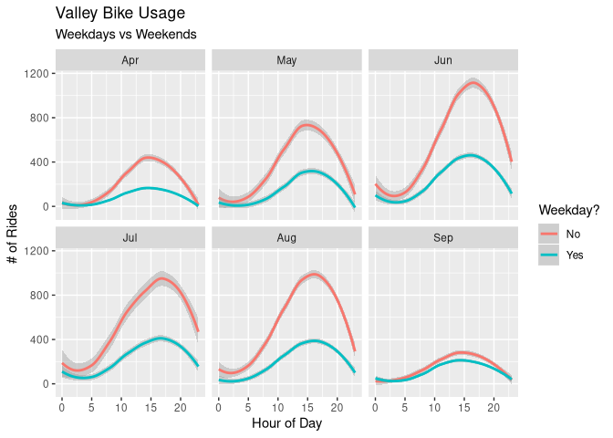

# `ValleyBikes`

The `ValleyBikes` package aims to make it easier to explore and analyze
public data from the Pioneer Valley bikeshare initiative: [Valley
Bike](https://valleybike.org/).

## Installation Instructions

The `ValleyBikes` package is online available for everyone. To install
you will need the `devtools` package.

``` r
# install the development version from GitHub
devtools::install_github("Amherst-Statistics/ValleyBikes")
```

To load the package:

``` r
library(ValleyBikes)
library(dplyr)
```

Now we can begin exploring bike data\!

## Looking at the Data

There are two tables in our data package:

  - `stations`: contains information about all the stations.
  - `routes`: contains the start and end entries for all bike rides
    (routes) taken.

Let’s take a look at the `stations` table:

``` r
head(stations)
## # A tibble: 6 x 7
##   serial_num address station_name num_docks latitude longitude
##        <dbl> <chr>   <chr>            <int>    <dbl>     <dbl>
## 1         19 330 Ho… Holyoke Com…        16     42.2     -72.7
## 2         50 Congre… Congress St…        10     42.1     -72.6
## 3         17 South … South Holyo…        15     42.2     -72.6
## 4         22 YMCA/C… YMCA/Childs…        17     42.3     -72.6
## 5         23 20 Wes… Forbes Libr…        13     42.3     -72.6
## 6         13 Spring… Springdale …         4     42.2     -72.6
## # … with 1 more variable: community_name <chr>
```

Now let’s take a look at the `routes` table:

``` r
head(routes)
## # A tibble: 6 x 6
##   route_id         bike  date                latitude longitude user_id    
##   <chr>            <chr> <dttm>                 <dbl>     <dbl> <chr>      
## 1 route_06_2018@d… 924   2018-06-28 09:09:32     42.3     -72.6 1cc1e858-8…
## 2 route_06_2018@d… 924   2018-06-28 12:33:57     42.3     -72.6 1cc1e858-8…
## 3 route_06_2018@3… 984   2018-06-28 11:43:09     42.3     -72.6 72491657-3…
## 4 route_06_2018@3… 984   2018-06-28 12:11:54     42.3     -72.6 72491657-3…
## 5 route_06_2018@8… 935   2018-06-28 11:43:35     42.3     -72.6 72491657-3…
## 6 route_06_2018@8… 935   2018-06-28 11:54:15     42.3     -72.6 72491657-3…
```

## Analyzing Usage Patterns

Suppose that we want to explore the difference between weekdays and
weekends for 2019. We can easily create a plot:

``` r
library(ggplot2)
library(lubridate)
```

``` r
routes %>%
    filter(year(date) >= 2019) %>% 
    mutate(hour = hour(date), day = wday(date, label=T, abbr=T),
           month = month(date, label = T, abbr = T)) %>%
    mutate(weekday = ifelse(day == "Sun" | day == "Mon", "Yes", "No")) %>% 
    count(route_id, hour, weekday, month) %>%
    count(hour, weekday, month) %>% 
    ggplot(aes(x = hour, y = n, color = weekday)) +
    geom_smooth(method = "loess") +
    facet_wrap(~ month) +
    labs(x = "Hour of Day", y = "# of Rides", color = "Weekday?", 
         title = "Valley Bike Usage", subtitle = "Weekdays vs Weekends")
```

<!-- -->

From the figure we can see that the gap between weekdays and weekends
increases in summer and suddenly dissapears when school starts.
